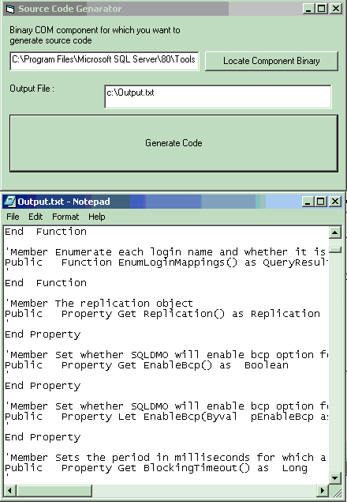



## COM Function Extrator

### Description

Generate source code from binary COM Components.Locate the binary components which exposes some public members and this tool will generate the source code for public members And you may now write the functionality for them.This is very useful if you have to build some solution bases on already existing object model and you don't have code for that.With this tool vb6 source code is generated and youmay write the rest of functionality.This is also good to study the obejct model of 3rd part tools or application.
 
### More Info
 
Binay COM Component (DLL.. etc)

Locate Word.exe (on any Com component) and click on generate code.This will extract information from Word.exe (on any Com component) and create c:\output.txt file (as specified).Open file in notepad and search 

----

this will jump through all public classes in word.exe.Copy the code between two 

----

and paste in vb 6.0 active x exe project class.Name the class as printed in output text file.Set instancing property by reviewing the word.exe.For this you may use anothe vb project and add ref. to microsoft word and try typing code like

Dim a as Word.XXX

and

Dim B as new Word.YYY

The Class YYY are public Multiuse/Single use

where as XXX are Public not creatable or an interface.

Just by copting and pasting you can study the structure of any com application object model before you design solution for you problem.

C:\output.txt - File having the signature of public members.You may change the location from txt box

             |
---                |---
**Submitted On**   |2006-09-12 20:04:06
**By**             |[Rajneesh Noonia](https://github.com/Planet-Source-Code/PSCIndex/blob/master/ByAuthor/rajneesh-noonia.md)
**Level**          |Advanced
**User Rating**    |4.7 (14 globes from 3 users)
**Compatibility**  |VB 6\.0
**Category**       |[OLE/ COM/ DCOM/ Active\-X](https://github.com/Planet-Source-Code/PSCIndex/blob/master/ByCategory/ole-com-dcom-active-x__1-29.md)
**World**          |[Visual Basic](https://github.com/Planet-Source-Code/PSCIndex/blob/master/ByWorld/visual-basic.md)
**Archive File**   |[Source\_Cod2019389122006\.zip](https://github.com/Planet-Source-Code/rajneesh-noonia-com-function-extrator__1-66526/archive/master.zip)

